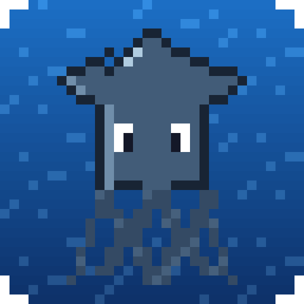

<p align="center"></p>

 > **NOT AN OFFICIAL MINECRAFT PRODUCT. NOT APPROVED BY OR ASSOCIATED WITH MOJANG OR MICROSOFT.**
  > Minecraft is a trademark of Microsoft Corporation.

# Squid

A Minecraft mod loader, made from scratch. It works with the [Kelp](https://github.com/KelpSquid/kelp) launcher and Minecraft 26.3.

## Your first mod in 5 minutes

1. In Kelp, open **Instances**, pick one, click **Mods**, then **New Mod**.
2. Type a name, like "Rainbow Sheep", and click **Create**. Kelp makes `RainbowSheep.java` and opens it.
3. Change what's inside `start()`, save, and play. That's it: no build step, no jar. Squid compiles it as the game starts.
4. Already playing? Just save again. Squid notices, builds it, and swaps the new version in while you play (the chat says
   "Reloaded Rainbow Sheep!"). A mistake keeps the old version running and says which line to fix.

```java
public class RainbowSheep extends EasyMod {
    void start() {
        say("Rainbow Sheep is working!");

        onKey("H", () -> {
            say("You pressed H! You're at " + x() + ", " + y() + ", " + z());
            playSound("entity.experience_orb.pickup");
        });
    }
}
```

| Command | What it does |
| --- | --- |
| `say("Hi!")` | A chat message only you see |
| `showText("Hi!")` | Text just above your hotbar |
| `playSound("entity.experience_orb.pickup")` | Plays a sound only you hear |
| `giveItem("diamond", 3)` | Gives you items (cheats need to be on) |
| `command("time set day")` | Runs a command, like typing `/time set day` |
| `splash("Hi!")` | Changes the yellow text on the title screen |
| `title("Boss!", "Good luck")` | Big text in the middle of the screen (the second part is smaller) |
| `boost(1.2)`, `dash(2)` | Shoots you up, or forward the way you're looking |
| `particles("heart", 10)` | Particles around you only you see (`"flame"`, `"note"`, `"happy_villager"`...) |
| `onJoin(() -> { ... })` | Runs when you join a world |
| `onKey("H", () -> { ... })` | Runs when you press a key (players can change it in Controls) |
| `every(10, () -> { ... })` | Runs every 10 seconds |
| `after(3, () -> { ... })` | Runs once, 3 seconds from now (works inside other commands too, for countdowns) |
| `onTick(() -> { ... })` | Runs 20 times a second |
| `onHurt(() -> { ... })`, `onDeath(() -> { ... })` | Runs when you get hurt, or die |
| `onCommand("dance", () -> { ... })` | Your own chat command: typing `!dance` runs it (and isn't sent). `onCommand("shout", words -> ...)` gets what's typed after it |
| `onChat(text -> { ... })` | Runs for every chat message you see (`"<Steve> hi"`, `"Alex joined the game"`), not mods' own |
| `onBreak(block -> { ... })` | Runs when you break a block, with its name (`"stone"`, `"diamond_ore"`) |
| `onAttack(mob -> { ... })` | Runs when you hit a mob, with what it is (`"zombie"`, `"player"`) |
| `onPickup(item -> { ... })` | Runs when you pick up an item, with its name (`"diamond"`, `"apple"`) |
| `keepShowing(() -> "Diamonds: " + diamonds)` | Text that stays in the top-left corner, always up to date |
| `glow("creeper")`, `stopGlowing("creeper")` | Outlines every mob of a kind, so you see them through walls (only you) |
| `remember("diamonds", 5)`, `remembered("diamonds", 0)` | Keeps a number for next time you play, and gets it back (or the starting number) |
| `onBeat(() -> { ... })` | Runs on every beat of the music: Jukebox songs (Squid finds their beat) and `.sqda` beats |
| `musicLevel()`, `nowPlaying()` | How loud the music is (0 to 1), and what's playing |
| `x()`, `y()`, `z()`, `health()`, `playerName()`, `random(1, 6)` | Things to know |
| `biome()`, `dimension()`, `isNight()`, `isRaining()`, `holding()`, `lookingAt()` | Where you are, what's in your hand, and the block or mob you're looking at |
| `nearby("creeper", 16)` | How many of a mob are within 16 blocks (`""` counts every mob) |
| `setting("Show map", true)`, `setting("Zoom", 4, 1, 10)` | A setting players change in the Mods screen (top-left of the title screen and pause menu) |

If there's a mistake, the game still opens. The title screen and Kelp say which line it's on and what's wrong, like *"there's a mistake on line 3: a ; is missing at the end of the line"*. A mod that goes wrong while you play says so in the chat and switches that part off.

When you're ready for more, `squid()` gives an easy mod everything below.

## Bigger mods: projects

When one file isn't enough, make a project: a folder in `mods` with as many files as you like. Squid builds it the
same way, as the game starts. There's nothing to install and no build step.

```
mods/
  RainbowSheep.java      an easy mod
  MegaMod/               a project
    squid.json           {"name": "Mega Mod"}
    src/                 the code: MegaMod.java, and any other files and folders
    resources/           pictures and sounds
```

`squid.json` only needs what isn't obvious. The id and name come from the folder (`MegaMod` is `mega-mod`,
"Mega Mod"), the version starts at `1.0`, and the main class is the one named like the folder. A mistake says which
file it's in: *"there's a mistake in src/Second.java on line 2: a ; is missing at the end of the line"*.

Everything `squid.json` can have:

| Key | What it is |
| --- | --- |
| `id` | a-z, 0-9, `_` and `-`. Its settings are saved under it, so keep it the same between versions |
| `name` | what players see |
| `version` | like `"1.2"`. Of two copies of a mod, Squid loads the newer one |
| `description` | a sentence about it |
| `authors` | `["You", "A Friend"]`, or just `"You"` |
| `depends` | ids of mods it needs. Squid starts those first |
| `minecraft` | the versions it works on: `"26.3"`, `"26.3.x"` (26.3 and its updates), `">=26.3"`, or a list |
| `main` | the class Squid starts |
| `side` | `"client"` (the game, the default), `"server"`, or `"both"` |
| `icon` | a picture in `resources`, shown in Kelp's Mods screen. `icon.png` if left out. New projects get one made from their name |

A key Squid doesn't know is written in the log, with a guess when it looks like a typo (`"author"`: *did you mean
"authors"?*). Kelp writes `id` and `main` for new projects, so renaming the folder later can't break the mod.

**One mod never stops the game.** A mod with a mistake, a broken `squid.json`, a second copy of a mod, a mod that
needs a missing mod, or mods that need each other in a loop: each is skipped with a reason (Kelp shows it), and the
game opens without it. The ids `squid`, `minecraft` and Squid's own parts (`squid-store`, `squid-replay`...) are
taken.

In Kelp, **New Mod** can make a project for you, already set up for VS Code and IntelliJ. They autocomplete every Squid
and Minecraft command and explain each one, using the Squid library that comes with Squid (`squid-api.jar` and its
code, in Kelp's `squid/library` folder).

Not using Kelp? The **Squid Kit** has the same library on its own, with its docs as web pages, an example project and
a readme. It's on the [Releases](https://github.com/KelpSquid/squid/releases) page, and `build.bat` makes it in
`build/squid-kit-<version>.zip`.

## .squid files

**Pack** in Kelp squishes a project into one small `.squid` file, for sending to friends or to the Store. Drop it in
`mods` and it works like the folder did. Its code stays readable inside, so anyone (and the Store's reviewer) can check
every line before it runs. Squid builds it the first time and keeps the result.

A `.squid` is a zip with `squid.json`, `src/` and `resources/` at the top. Packing the same project twice gives the
exact same file (so its fingerprint is the same too), and junk like `Thumbs.db` and `.DS_Store` stays out. Zipped by
hand works too, even with the whole folder inside or Windows' `\` between folders.

## .sqda files

`.sqda` is Squid's own sound file, made for resource packs and mods. Next to the sound (squeezed by Squid Music,
Squid's own codec) it carries loop points, a volume track, beat and bar cues, light cues, the sound's settings
(subtitle, volume, pitch, distance), sounds to play when a mob comes into view, and info like the title and artist.
Drop one into a resource pack where an `.ogg` would go.

Make them with Kelp's **Sound Maker**, or SqdaTool:

```
java -cp squid.jar squid.audio.SqdaTool song.mp3 --loop 12.5 end --bpm 120 --title "My Song"
java -cp squid.jar squid.audio.SqdaTool --info song.sqda
```

Every chunk carries a check, so a damaged download is caught instead of playing noise, and the file says which
codec version it uses, so a future Squid Music can't break old songs. The full layout is in
[docs/sqda.md](docs/sqda.md).

## Built in

Everyone gets these, no downloads needed. One **Squid** button on the title screen and pause menu opens the Squid menu.

- **Store:** mods, resource packs and capes, all approved first. A **Store** button sits next to Realms.
- **Mods:** every mod with an on/off switch, and its settings. Saving a mod you're writing reloads it while the
  game runs (live reload).
- **Mod Maker:** Squid > Mod Maker: make an easy mod from a name, or change one, right in the game. Save (or Ctrl+S)
  runs it a second later, and the editor says "Reloaded!" or which line has a mistake. A new mod can start from any
  of the 13 starter mods (Rocket Boots, Creeper Radar...). Its Commands list types in
  any command with an example, so you can make a mod without knowing them by heart.
- **Voice chat:** on servers with Squid, talk to players near you or in your group (push to talk, or always on),
  with a voice changer: Robot, Chipmunk, Giant or Echo.
- **Emotes:** press J for the emote wheel (Wave, Love, Laugh, GG, Angry, Sad, Wow, Sleepy). It pops up above your
  head, with particles, for everyone near you with Squid. Always one of the eight, never typed words.
- **Skins and capes:** Options > Skin Customization > Squid Skin & Cape: wear your own skin and cape, a Store cape,
  or a Mojang cape (shown from Mojang's own servers, with a tag if you don't own it), with animated effects.
- **Squid Count:** points for every advancement, like gamerscore. Making things counts too: your first painting, swapped
  sound, recording, Mod Maker mod, emote, song and karaoke song each earn points once.
- **Panorama:** capture a spinning title-screen background where you stand, and set its speed and direction.
- **Clips:** F8 saves the last 30 seconds as a video, with sound, which shows in Kelp's Gallery.
- **Replay:** F9 rewinds the last few minutes, Skate 3 style: watch it from any angle with Free, Follow, Tripod
  or Path (keyframe) cameras, a lens setting, slow motion, backwards, trim, sounds and particles. Save replays to
  watch later, or export them as videos.
- **Sounds:** resource packs can use `.wav`, `.mp3`, `.flac`, `.m4a` and `.sqda` sounds and music, not just `.ogg`.
  Squid has its own decoders for all of them (`squid.audio`), written from scratch, including AAC (the sound in
  iTunes and phone `.m4a` files), which decodes to the sample the same as ffmpeg. Surround files play as stereo, and a
  damaged file plays what it can instead of breaking the game's sound.
- **Jukebox:** your own music in the game. Put songs (MP3, M4A, FLAC, WAV, Ogg or `.sqda`) in the `music` folder in
  Kelp's folder, or drop them onto Squid > Jukebox. Play, pause, skip, shuffle and repeat; Minecraft's own music
  waits while a song plays, a Now Playing card shows the title and artist from the file's tags, and it follows the
  Music volume slider. Mods can move with it through `SquidAudio.level()`. A song with an .lrc lyrics file next to it
  (same name) shows its words above the hotbar as they're sung, karaoke style.
- **Block Painter:** Squid > Block Painter: pick any block, repaint its texture pixel by pixel (with the block's own
  colors at hand, a Fill bucket and a 3 x 3 preview), or drop any picture on it to turn it into pixel art, and Save.
  Squid keeps your paintings in a "Squid Paint" resource pack it makes and switches on for you, so the world changes
  right away; Reset brings Minecraft's own texture back. Items, animated blocks, mobs (a pig's skin) and the paintings
  on walls too, so you can hang your own photo in your house.
- **Sound Swapper:** Squid > Sound Swapper: pick any Minecraft sound (a pig's oink, the door creak...), hear it, and
  drop your own sound file on it, or press Record and make the sound yourself (the quiet bits at the ends are cut
  off), with an effect if you like: Chipmunk, Giant, Robot, Echo or Backwards. Music discs and the game's music take
  whole songs (up to 8 minutes), so you can make a disc of your favorite song. It goes in the same pack as a `.sqda`, so Squid plays it in its place (only Squid players hear swapped
  sounds).
- **120 languages:** Squid's own texts follow Minecraft's language setting (BETA, not checked yet).

## How it works

Kelp starts Squid instead of Minecraft. Squid:

1. finds the mods in the instance's `mods` folder,
2. lets each mod set up its hooks,
3. starts Minecraft through its own class loader, so the hooks get written into Minecraft's code as each class loads.

## Building

You need Kelp to have downloaded Minecraft 26.3 once, because Squid builds with the Java 25 that Kelp downloads for it.

```
build.bat         builds build/squid.jar, the built-in parts, the example mods and the Squid library, and copies them into Kelp's folder
build.bat test    also runs the tests (they load real Minecraft classes without opening the game, and build every
                  example with just the Squid library)
```

## The Store

The Squid Store is built into Squid (`builtin/store`), so everyone has it: a **Store** button on the title screen, next to Realms. It has four tabs: **Dev-picked**, **Mods**, **Packs** and **Capes**. Install puts a mod in `mods` (it starts next time the game opens) or a resource pack in `resourcepacks`.

The store reads one list, `store.json`, from the [squid-store](https://github.com/KelpSquid/squid-store) repo. Every item has a fingerprint (sha256), and a download that doesn't match it is thrown away. Nothing gets in the list without being approved; submissions will come through submit.kelplauncher.org.

`build.bat` makes `build/store`: a `store.json` and a `files` folder with every first-party mod. Upload both to the squid-store repo and the store shows them. To test with another list, start the game with `-Dsquid.store=<link to a store.json>`.

## Making a mod

A Squid mod is a `.jar` with a `squid.json` inside:

```json
{
    "id": "hello-squid",
    "name": "Hello Squid",
    "version": "1.0.0",
    "description": "Changes the title screen splash to prove Squid works.",
    "authors": ["Samuel"],
    "main": "hello.HelloSquid"
}
```

If your mod needs another mod, list its id in `"depends": ["other-mod"]`. Squid starts that mod first.

`"minecraft"` says which Minecraft versions your mod works on: `"26.3"` for just that one, `"26.3.x"` for 26.3 and its updates, or a list like `["26.3.x", "26.4"]`. Leave it out and Squid tries your mod on any version.

Squid never lets one mod stop the game from opening. A mod for a different version, a second copy of a mod, or a mod missing something it needs is skipped, and Kelp says why.

`main` is a class that implements `SquidMod`:

```java
public class HelloSquid implements SquidMod {
    @Override
    public void init(Squid squid) {
        squid.atStart("net.minecraft.client.resources.SplashManager", "getSplash", call ->
                call.cancel(new SplashRenderer(Component.literal("Squid is working!"))));
    }
}
```

What a mod can do in `init`:

- `atStart(class, method, hook)` runs code at the start of a method. `call.cancel(value)` skips the rest of it.
- `atEnd(class, method, hook)` runs code when a method returns. `call.setReturnValue(value)` changes what it returns.
- `onHud(hud -> ...)` draws on the screen every frame: `hud.box(...)`, `hud.text(...)`, `hud.outline(...)`.
- `onTick(() -> ...)` runs 20 times a second.
- `addKeyBinding(name, key)` adds a key to Minecraft's Controls screen, where players can change it. `isDown()` says if it's held, `pressed()` if it was just pressed.
- `settings()` gives the mod settings players change in the Mods screen: `toggle(name, default)`,
  `number(name, default, min, max)` and `choice(name, default, choices...)`.
- `addMenuButton(label, inWorldOnly, menu -> ...)` adds a button to the Squid menu, to open the mod's own screen.
- `patch(class, node -> ...)` changes a class's bytecode directly with [ASM](https://asm.ow2.io/).

Set hooks up in `init` before touching any Minecraft class, or that class will already be loaded without them. See [`examples`](examples) for whole mods: Hello Squid, Zoom, Compass and Minimap.
